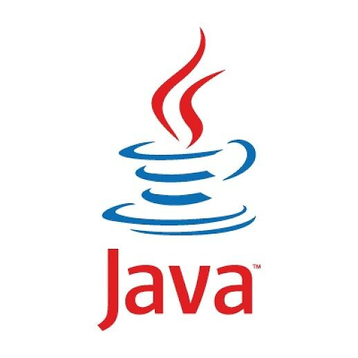
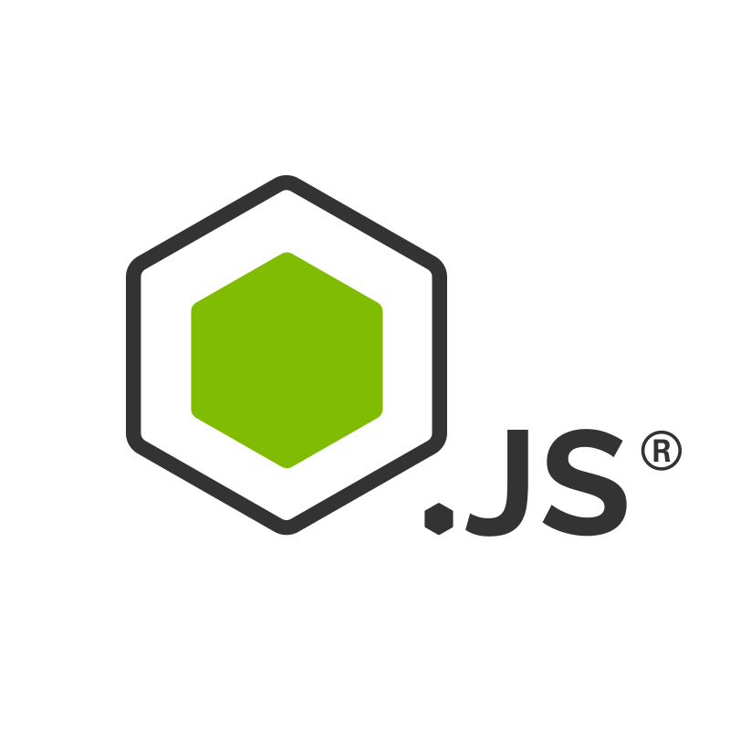
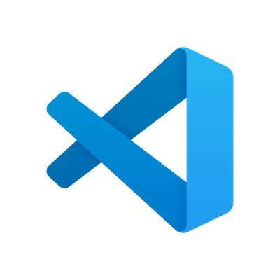

<h1 align="center"> Hello There 👋 </h1>

- I am [Adrian Hartley](www.linkedin.com/in/hannah-adrian-hartley) :blush: .
  Currently I am a student at Lambda School enrolled in the Full Stack Web
  Development program

- I have done multiple projects ranging from backends, front ends, and
  algorythms :file_cabinet: .

- I am currently brushing up my skills and plan to learn Vue.js and Django .

- I am willing to work on free-lance projects and love to contribute to open
  source projects :bulb:

<!-- * :magnet: You can checkout my projects from here :fire: -  -->

- Connect with me on LinkedIn :fireworks:
  [Profile](www.linkedin.com/in/hannah-adrian-hartley) :sparkler:

## Tech Stack :computer:

 
<table>
<tbody>
 <tr>
<td align="center" width="20%">
<b>
JavaScript
</b> 
 
</td>

<td align="center" width="20%">
<b>
Java
</b> 
 
</td>

<td align="center" width="20%">
<b>
Spring Boot
</b> 
 
</td>
</tr>

<tr>
<td align="center" width="20%">
<b>
React.js
</b> 
 
</td>

<td align="center" width="20%">
<b>
Git
</b> 
 
</td>

<td align="center" width="20%">
<b>
Python
</b> 
 
</td>
</tr>

<tr>
<td align="center" width="20%">
<b>
Vercel
</b> 
 
</td>

<td align="center" width="20%">
<b>
Postgres SQL
</b> 
 
</td>

<td align="center" width="20%">
<b>
JetBrains IDEs
</b> 
 
</td>
</tr>

<tr>
<td align="center" width="20%">
<b>
Node.js
</b> 
 
</td>

<td align="center" width="20%">
<b>
Visual Studio Code
</b> 
 
</td>

<td align="center" width="20%">
<b>
Microsoft Office Specialist
</b> 
 
</td>
</tr>

</tbody>
</table>

